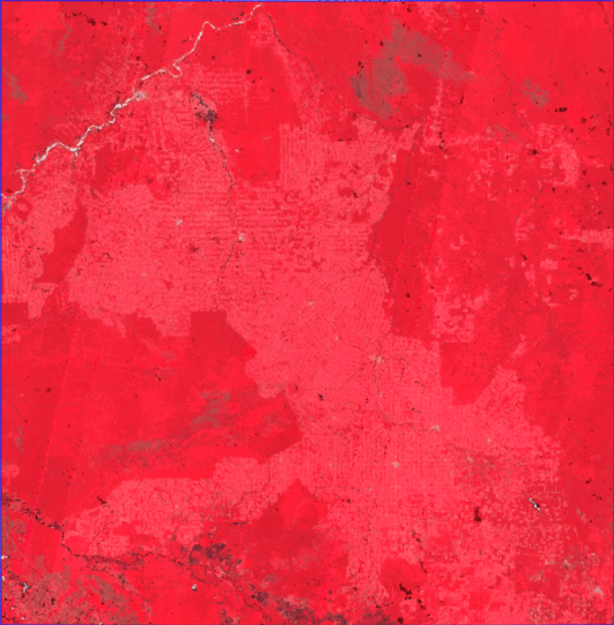

# 🌳 Amazon Deforestation Monitoring – Sub-Region Analysis (Rondônia Hotspot)

**Monitoring deforestation in the Brazilian Amazon using Sentinel-2 imagery and Google Earth Engine**

📅 Time period: 2023 vs 2024

📍 Focus area: Southern Rondônia / Northern Mato Grosso / Amazonas

🛠 Tech stack: Google Earth Engine, Sentinel-2 SR, Leaflet.js, GitHub Pages, Git LFS

🔗 Live map:
👉 [](https://frankradium.github.io/Amazon-Deforestation-Monitoring-Sub-Region-Analysis-Rondonia-Hotspot-/)</button>

---

Animated Change:

---


---

## 📌 Project Overview

This project demonstrates a complete end-to-end remote sensing workflow for detecting and visualizing potential deforestation in the Brazilian Amazon.

It combines:

* Cloud-scale satellite processing in Google Earth Engine
* NDVI-based change detection**
* Vectorization of forest-loss hotspots
* An **interactive Leaflet web map** for public dissemination

Due to computational and export constraints of the full Amazon basin, the analysis focuses on a **high-deforestation sub-region (~300,000 km²)** within the Arc of Deforestation.

---

## 🎯 Objectives

* Detect potential forest loss between **2023 and 2024**
* Quantify the approximate forest loss area
* Visualize results in an interactive web map
* Publish a reproducible and portfolio-ready workflow

**Deliverables**

* Public Google Earth Engine script
* Forest loss summary statistics
* Animated year-to-year visualization
* Interactive Leaflet map with:

  * Year toggle (2023 / 2024)
  * Independent deforestation hotspots layer
  * Clickable polygons with area estimates

---

## Study Area

**AOI**: Southern Rondônia, northern Mato Grosso, and Amazonas

* Bounding box: **[-65°, -13°] to [-60°, -8°]**
* Approximate area: **~300,000 km²**
* Known region of accelerated deforestation

Defined in GEE as:

```javascript
var testAOI = ee.Geometry.Rectangle([-65, -13, -60, -8]);
```

---

## 🛰 Data & Preprocessing

**Dataset**

* Sentinel-2 Surface Reflectance
  (`COPERNICUS/S2_SR_HARMONIZED`)

**Key parameters**

* Cloud cover < 50%
* QA60 cloud & cirrus masking
* NDVI = (B8 − B4) / (B8 + B4)

**Annual composite**

* Per-pixel **maximum NDVI quality mosaic**
* Prioritizes cloud-free, healthy vegetation observations

---

## 🔍 Change Detection Method

1. Generate max-NDVI mosaics for **2023** and **2024**
2. Compute NDVI difference:

   ```
   NDVI_2024 − NDVI_2023
   ```
3. Flag potential deforestation where:

   * NDVI drop ≥ **0.20**
   * 2024 NDVI < **0.55**

**Estimated potential forest loss**
➡️ **~579 km²** (coarse 100 m estimate)

---

## 📊 Summary Statistics

| Metric                             | Value    |
| ---------------------------------- | -------- |
| Sentinel-2 images processed (2023) | 2,684    |
| Sentinel-2 images processed (2024) | 2,518    |
| Mean NDVI (2023)                   | 0.832    |
| Mean NDVI (2024)                   | 0.835    |
| Estimated potential forest loss    | ~579 km² |

---

## 🧭 Visualization Outputs

### In Google Earth Engine

* False-color composites (NIR–Red–Green)
* NDVI layers
* NDVI change map
* Binary forest-loss mask

### Vectorized Hotspots

* Extracted using `reduceToVectors`
* 60 m scale, simplified geometries
* Exported as GeoJSON (Git LFS)

### Interactive Web Map

🔗 Click Here [](https://frankradium.github.io/Amazon-Deforestation-Monitoring-Sub-Region-Analysis-Rondonia-Hotspot-/)</button>

**Features**

* Toggle between 2023 & 2024 imagery
* Independent deforestation hotspots checkbox
* Clickable polygons with area (ha)
* Legend and contextual info panel

---

## ⚙️ Technical Challenges & Solutions

| Challenge             | Solution                                      |
| --------------------- | --------------------------------------------- |
| Full Amazon too large | Scoped to high-priority sub-region            |
| Export limits         | Raster exports at 30 m, vectors at 60 m       |
| GeoJSON >25 MB        | Git LFS + `media.githubusercontent.com` fetch |
| Local CORS issues     | Local HTTP server for development             |
| Web performance       | Geometry simplification + lazy loading        |

---

## ⚠️ Limitations

* Annual comparison only (no seasonal dynamics)
* Conservative NDVI thresholds
* Coarse area estimates
* Sub-region not representative of the entire Amazon
* Small patches may be merged or lost during simplification

---

## 🚀 Future Improvements

* Monthly or seasonal NDVI time series
* Expanded coverage (Arc of Deforestation)
* Validation with MapBiomas / Hansen GFC
* Time slider animation in Leaflet
* Area-weighted statistics and dashboards
* Vector tiles (PMTiles) for large-scale performance
---

## Conclusion

This project showcases a **scalable, reproducible, and visually intuitive workflow** for monitoring deforestation using open satellite data and modern web mapping tools.
